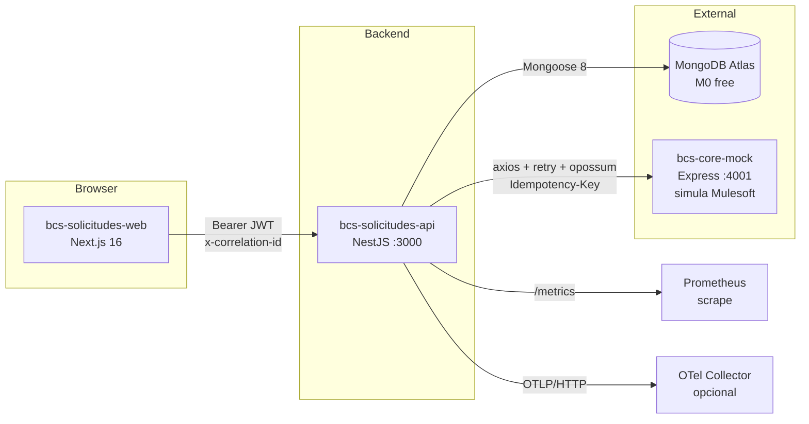

# bcs-solicitudes-api

> Backend de la **plataforma de solicitudes digitales de productos bancarios** — Prueba Técnica BCS, rol Líder Técnico.

[]() []() []() []()

**Repos hermanos:**
- 🎨 Frontend: [andresrojas686/bcs-solicitudes-web](https://github.com/andresrojas686/bcs-solicitudes-web)
- 🧪 Mock Mulesoft: [andresrojas686/bcs-core-mock](https://github.com/andresrojas686/bcs-core-mock)

## Visión general

Plataforma para que asesores del BCS creen, gestionen y finalicen solicitudes de productos bancarios (cuenta de ahorros, tarjeta de crédito, libre inversión). Incluye:

- **CRUD de solicitudes** con máquina de estados auditada (DRAFT → IN_REVIEW → APPROVED → FINALIZED).
- **Integración con el Core Bancario vía Mulesoft** — abstracción anti-corrupción + retry exponencial + circuit breaker + idempotencia outbound.
- **Auditoría con hash SHA-256** de documentos en colección dedicada.
- **Observabilidad de tres pilares**: logs estructurados con redacción PII automática, métricas Prometheus, traces OpenTelemetry.
- **Auth JWT** con roles (`ASESOR`, `SUPERVISOR`, `ADMIN`).
- **88 tests verde** end-to-end.

## Arquitectura



## Stack

| Capa | Tecnología |
|---|---|
| Runtime | Node.js 20+ · TypeScript estricto |
| Framework | NestJS 10 |
| Persistencia | MongoDB Atlas + Mongoose 8 |
| Auth | passport-jwt + bcrypt + NextAuth.js (frontend) |
| Validación | class-validator + class-transformer + Zod (env) |
| Resiliencia Core | axios + axios-retry + opossum |
| Logs | nestjs-pino con redacción PII |
| Métricas | @willsoto/nestjs-prometheus + prom-client |
| Tracing | @opentelemetry/sdk-node + auto-instrumentations |
| Tests | Jest + Supertest + mongodb-memory-server |
| Doc API | @nestjs/swagger (OpenAPI 3.0 en `/api/docs`) |

## Prerrequisitos

- Node.js 20+
- pnpm 10+
- Cluster MongoDB Atlas (free tier M0). Ver [`docs/ATLAS-SETUP.md`](docs/ATLAS-SETUP.md) — setup en ~5 min.

## Inicio rápido

```bash
# 1. Crear cluster Atlas siguiendo docs/ATLAS-SETUP.md
# 2. Copiar el connection string al .env
cp .env.example .env
# Edita .env: pega tu MONGODB_URI

# 3. Instalar e iniciar
pnpm install
pnpm seed                    # opcional: pobla 4 solicitudes de muestra
pnpm dev                     # arranca Nest :3000 + bcs-core-mock :4001 en paralelo
```

Verificación:
- **Swagger UI**: <http://localhost:3000/api/docs>
- **Health (liveness)**: <http://localhost:3000/health>
- **Readiness (Atlas + core-mock)**: <http://localhost:3000/health/ready>
- **Métricas Prometheus**: <http://localhost:3000/metrics>

### Modo offline (sin internet)

```bash
# Terminal 1 — Mongo en memoria
pnpm dev:db:local

# Terminal 2 — Backend (edita .env: MONGODB_URI=mongodb://127.0.0.1:27017/bcs-solicitudes)
pnpm dev
```

## Variables de entorno

Ver [`.env.example`](.env.example). Las clave:

| Variable | Default | Propósito |
|---|---|---|
| `MONGODB_URI` | (requerido) | Connection string SRV de Atlas |
| `JWT_SECRET` | (requerido, ≥16 chars dev / ≥32 prod) | Firma JWT HS256 |
| `CORE_MOCK_URL` | `http://localhost:4001` | URL del adapter Mulesoft |
| `CORE_BANKING_TIMEOUT_MS` | `5000` | Timeout por intento al Core |
| `CORE_BANKING_MAX_RETRIES` | `3` | Reintentos del adapter |
| `CORS_ORIGINS` | `http://localhost:3001` | Lista separada por comas |
| `LOG_LEVEL` | `info` | `fatal\|error\|warn\|info\|debug\|trace` |
| `OTEL_EXPORTER_OTLP_ENDPOINT` | (opcional) | Si se setea, exporta traces a OTLP/HTTP |
| `OTEL_SDK_DISABLED` | `false` | `true` para apagar tracing en CI rápido |

## Endpoints principales

| Método | Ruta | Roles | Notas |
|---|---|---|---|
| POST | `/auth/login` | público (rate-limit 20/min) | JWT mock |
| GET | `/productos`, `/productos/:codigo` | ASESOR+ | Catálogo |
| GET | `/clientes/:tipoDoc/:numDoc` | ASESOR+ | Proxy Core |
| GET | `/clientes/:tipoDoc/:numDoc/productos-elegibles` | ASESOR+ | **HU-001** + cache + audit |
| POST | `/solicitudes` | ASESOR+ | `Idempotency-Key` requerido |
| GET | `/solicitudes?estado=&clienteNumDoc=&page=&size=` | ASESOR+ | |
| GET | `/solicitudes/:id` | ASESOR+ | Incluye historial |
| PATCH | `/solicitudes/:id` | ASESOR+ | Datos + opt. `enviarARevision` |
| POST | `/solicitudes/:id/aprobar` | SUPERVISOR | |
| POST | `/solicitudes/:id/rechazar` | SUPERVISOR | Motivo requerido en CA |
| POST | `/solicitudes/:id/abandonar` | ASESOR+ | |
| POST | `/solicitudes/:id/finalizar` | SUPERVISOR | **HU-002** llama Core |
| GET | `/health`, `/health/ready` | público | |
| GET | `/metrics` | público | Prometheus scrape |
| GET | `/api/docs`, `/api/docs-json` | público | Swagger UI / spec JSON |

## Flujo end-to-end (smoke)

```bash
pnpm smoke                    # 7 tests del MulesoftAdapter ↔ core-mock
bash scripts/smoke-api.sh    # 24 tests del API completo (auth + roles + flujo + rollback Core 422)
```

Credenciales de prueba: `asesor / asesor123` · `supervisor / super123` · `admin / admin123`.

Documentos de cliente sembrados en core-mock:
- `1111111111` → KYC OK, 3 productos, 201 al finalizar
- `2222222222` → KYC PENDIENTE, 1 producto
- `3333333333` → 503 los primeros 2 intentos, luego 201 (prueba retry)
- `4444444444` → 404 (no existe)
- `5555555555` → 422 al finalizar (prueba rollback Core → IN_REVIEW)

## Tests

```bash
pnpm test                    # Jest: 42 unit + 4 integración (mongodb-memory-server)
pnpm test:cov                # Coverage report
pnpm smoke                   # Smoke MulesoftAdapter
bash scripts/smoke-api.sh    # Smoke API end-to-end
```

## Documentación

| Tema | Ruta |
|---|---|
| Setup MongoDB Atlas paso a paso | [`docs/ATLAS-SETUP.md`](docs/ATLAS-SETUP.md) |
| Estrategia QA (ISTQB) | [`docs/qa/strategy.md`](docs/qa/strategy.md) |
| Playbook de liderazgo técnico | [`docs/leadership/playbook.md`](docs/leadership/playbook.md) |
| Política de uso de IA | [`docs/ai-usage/policy.md`](docs/ai-usage/policy.md) |
| Prompts representativos usados | [`docs/ai-usage/prompts.md`](docs/ai-usage/prompts.md) |
| Decisiones arquitectónicas (7 ADRs consolidados) | [`docs/decisions.md`](docs/decisions.md) |
| Historias técnicas Micrositio↔Core | [`docs/stories/`](docs/stories/) (HU-001, HU-002) |
| Contrato OpenAPI Core Bancario | [`openapi/core-banking.yaml`](openapi/core-banking.yaml) |

## Observabilidad

- **Logs**: pino JSON estructurado con `correlationId` end-to-end vía `AsyncLocalStorage`. Redacción de PII automática (`numDoc`, `email`, `password`, `authorization` → `[REDACTED]`).
- **Métricas custom**: `solicitudes_creadas_total{producto}`, `solicitudes_estado_actual{estado}`, `core_banking_request_duration_seconds{endpoint,status}`.
- **Tracing**: spans automáticos para HTTP, mongoose, axios, dns. Exporter consola por defecto, OTLP/HTTP configurable.

## Seguridad — checklist OWASP aplicada

| OWASP Top 10 (2021) | Mitigación |
|---|---|
| A01 Broken Access Control | `JwtAuthGuard` + `RolesGuard` globales, `@Public()` explícito en /health, /metrics, /auth/login |
| A02 Cryptographic Failures | JWT HS256 con secret en env, secrets fuera del repo, bcrypt para passwords mock |
| A03 Injection | DTOs validados (`whitelist:true, forbidNonWhitelisted:true`), Mongoose con queries parametrizadas |
| A04 Insecure Design | Máquina de estados defensiva (VO inmutable), `Idempotency-Key` obligatorio en mutaciones |
| A05 Security Misconfig | helmet, CORS allowlist, errores genéricos al cliente, stack traces solo en `NODE_ENV=development` |
| A06 Vulnerable Components | `pnpm audit` en CI, lockfiles commiteados |
| A07 Auth Failures | Throttler global 60/min + estricto 20/min en `/auth/login`, JWT con `exp` corto |
| A09 Logging Failures | Logs estructurados sin PII, retention configurable, correlationId persistido |
| A10 SSRF | Allowlist de hosts en `MulesoftAdapter` |

## Roadmap (qué dejaría para sprint 2+)

- Migrar `JWT mock` a Keycloak corporativo ([decisión #3](docs/decisions.md#3--jwt-mock-para-la-prueba-vs-keycloak) documenta el plan).
- Cache de `productos-elegibles` a Redis (actualmente in-memory, no escala multi-instancia).
- Job de retry diferido para solicitudes en `APPROVED + pendienteEnvioCore=true`.
- Mutation testing con Stryker en `estado-solicitud.vo`.
- Visual regression testing del frontend (Chromatic / Percy).
- HMAC body firmado en outbound al Core (documentado en HU-002, deferido).

## Trade-offs y limitaciones conocidas

- **JWT mock con HS256**: aceptable para prueba/dev, **no para producción** sin reemplazo a IdP corporativo.
- **Atlas Network Access `0.0.0.0/0`** durante la prueba: documentado, en producción sería allowlist + PrivateLink.
- **Cache in-memory** del proxy de clientes: per-instance; multi-instancia requiere mover a Redis.
- **Circuit breaker estado in-memory**: cada réplica decide independientemente. Para coordinación cross-instance considerar Hystrix-style con Redis.
- **OpenTelemetry sin Jaeger UI** en dev: intencional para no inflar setup. Documentado cómo habilitarlo.

## Autoría

Construido como prueba técnica para **BCS — rol Líder Técnico** (Backend + Frontend + QA + Integración + IA aplicada).

**Asistido por IA** en boilerplate, generación de tests exhaustivos, primera redacción de docs y ADRs. Decisiones de arquitectura, code review y firma de ADRs son humanas. Detalle: [`docs/ai-usage/prompts.md`](docs/ai-usage/prompts.md).
